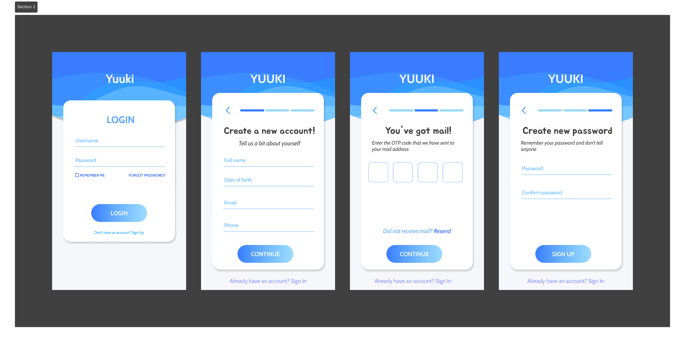
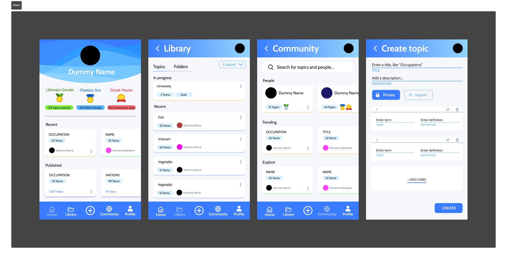
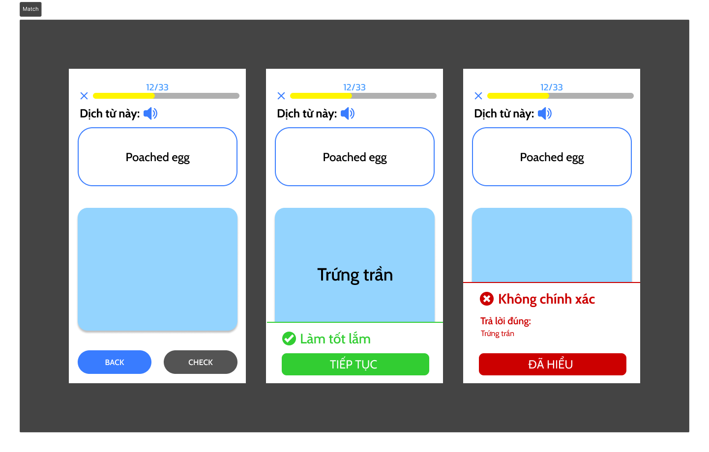

YUUKI - ENGLISH LEARNING APP
=======

Technologies:
-----------
Flutter, Dart, Cloud Firestore, Firebase Authentication

Overview
-----------
A cross platform English learning app where users can create, manage, and participate in learning many topics with multiple testing formats such as: flashcards, word match, and multiple choice.

Yuuki currently offers the following features:
1. **Login & Register:** easily sign up and login with email and password; upon account registration, an OTP code will be sent to user's phone number to confirm. 

2. **Forgot password & password reset:** Provides a way for users to recover their password if they forget it. This is done through a password reset link that can be issued to the registered email.

3. **Topic management:** users can create private/public topics; each topic starts with title and description, followed by an unlimited number of vocabularies that users want to add inside the topic. Users can also create folders to better organize their topics.

4. **Testing & Scoring:** Users can start a test on any public topic and topics that they created themselves. The highest score is always 100, the top users with the highest score and the shortest completion time of a topic will be display on the topic's leaderboard  for everyone to see.

4. **Flashcard (Test Format 1):** Each flashcard has two sides: one side shows the word in one language, and the other side shows the translation. Users can manually swipe through the flashcards, enable auto-mode, shuffle, and play the audio of the pronunciation

5. **Word match (Test Format 2):** The app will show a list of word (one at a time) from the topic, users must then type the corresponding translations into a textbox.

6. **Multiple choice (Test Format 3):** Each word is presented with four random choices: one correct answer and three incorrect options from the same topic.

7. **Community:** Users can search for topics and people, able to see other profiles and participate in learning others' public topics.

Images
-----------
**Login & Register Process**

**Main Screens**

**Word match test**
